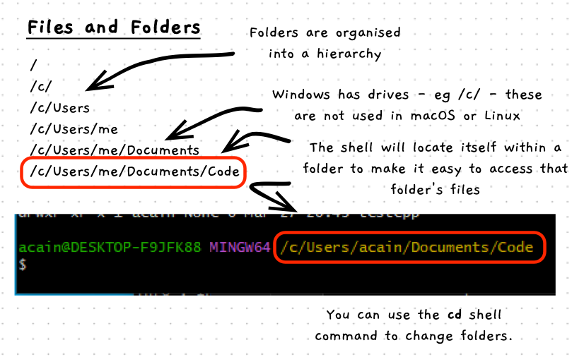

Working in the shell requires you to understand how the files on your computer are organised.



:::note[Folders...]

- are used to organise files.
- can contain other files and folders
- are also known as directories
- (except for the root folder) have a parent folder - the one in which the folder is located.

:::

:::note[The shell...]

- is situated within a folder - your home folder by default
- can change which folder it is in using the `cd` command (change directory)
- allows you to access files and folders relative to where it is currently located
- uses `.` to represent the current folder, and `..` to represent its parent folder.

:::

## Example

The following illustrates how we can move and work with files and folders in the shell.

```zsh
# move into the /c/Users/andrew/Documents/ folder
cd /c/Users/andrew/Documents

# Now we are in the Documents folder...
# move into the /c/Users/andrew/Documents/Code folder
cd Code

## Move back to /c/Users/andrew - the parent of the parent folder
cd ../..
```
