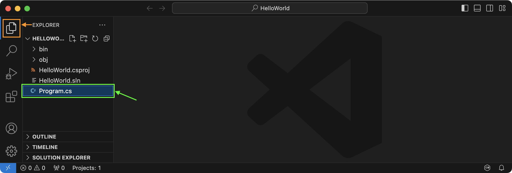

Here are the steps needed to build your own program:

1. Create a new folder for the project, and move into this in the terminal
2. Use `dotnet new console` to create the initial project files
3. Add the SplashKit package we will be using `dotnet add package splashkit`
4. Write the code in **Program.cs**
5. Build and run using `dotnet run`

Let's go through these steps to build a simple terminal-based program to output the text: "Hello, World".

:::note[Why "Hello World"?]
Whenever you start learning a new programming language, you will likely write code to output **"Hello, World"** for your first program - just like we are going to do here!

You can read more about the origin of "Hello, World" [here](https://en.wikipedia.org/wiki/%22Hello,_World!%22_program) if you're curious, but the short version is that it is a simple way of checking that your computer is set up correctly to code in a particular language.
:::

## Create the Project Folder

We will create a folder in our **Documents/Code** folder (which we created in the [Computer Use](/book/part-0-getting-started/2-computer-use/1-tour/3-1-terminal) chapter). If you are saving your code elsewhere then make sure to adjust paths as needed.

```zsh
# Windows users -see the following note
cd ~/Documents/Code

# Make a folder for the project
mkdir HelloWorld

# Move into that folder
cd HelloWorld
```

:::note
If you are using **MSYS2 MINGW64**:

- You will need to adjust the `cd` command slightly from what is shown in the command above, which will look similar to this:

    ```bash
    cd /c/Users/<your_username>/Documents/Code
    ```

    where you would replace **<your_username>** with your own username.
- To check your username, you can use the `whoami` command in your terminal.

:::

:::tip
You can also type `cd` ("cd", then space), then click and drag a folder from File Explorer or Finder into your terminal window.
:::

:::caution[Project Folders]

Remember to avoid adding *Spaces* in your folder names!

:::

## Create *dotnet* project files

We will be using C# initially, for these programs we need to setup project files that the language uses to know how to build your program.

To create the initial project files for this C# program, copy and paste the following commands into your Terminal window:

```bash
dotnet new console
dotnet add package splashkit
```

This creates the project, and add the splashkit library we will be using.

If you run `ls -lha` in the terminal after the commands above, it should look similar to this:


<div class="caption">Image not subject to The Programmer's Field Guide <a href="https://creativecommons.org/licenses/by-nc-nd/4.0/">CC BY-NC-ND 4.0 License</a></div>

Now you are ready to start coding your first program!

## Write your Code

From the terminal window, we can open the current folder in Visual Studio Code using the following command:

```bash
code .
```

:::note
If the `code .` command does not work on your computer, you can open Visual Studio Code, and then click *File > Open Folder*, and then navigate to the HelloWorld folder you created in the steps above. Make sure to open the folder itself.
:::

You will notice that shortly after opening the project, a **bin** folder and a **.sln** file will be added automatically:


<div class="caption">Image not subject to The Programmer's Field Guide <a href="https://creativecommons.org/licenses/by-nc-nd/4.0/">CC BY-NC-ND 4.0 License</a></div>

Open `Program.cs` file (shown above in Green box) by double-clicking the file in the Explorer tab (shown above in Orange box):

Copy the following code into your Program.cs file (replacing the existing code):

```cs
using static SplashKitSDK.SplashKit;

WriteLine("Hello, World!");
```

After the last line, you can add another `WriteLine("...")` bit of code with your own custom message!

:::caution

We will be using SplashKit for terminal input and output initially. Avoid using the `System.Console` version for now, but we will come back to this once we have moved beyond the basics.

:::

## Build and Run your Code

Let's turn your code into a program! Like magic!

Use the following command to build and run the program:

```bash
dotnet run
```

:::tip[Use the Terminal inside VS Code!]
To avoid having to switch back and forth between your apps, you can open a Terminal shell inside Visual Studio Code by clicking "Terminal" (one of the tabs across the top of the window/screen), and then click on "New Terminal".
:::

Here is what the result will look like:


<div class="caption">Image not subject to The Programmer's Field Guide <a href="https://creativecommons.org/licenses/by-nc-nd/4.0/">CC BY-NC-ND 4.0 License</a></div>

Next, we are going to create a **Graphical** *Hello World* program!
