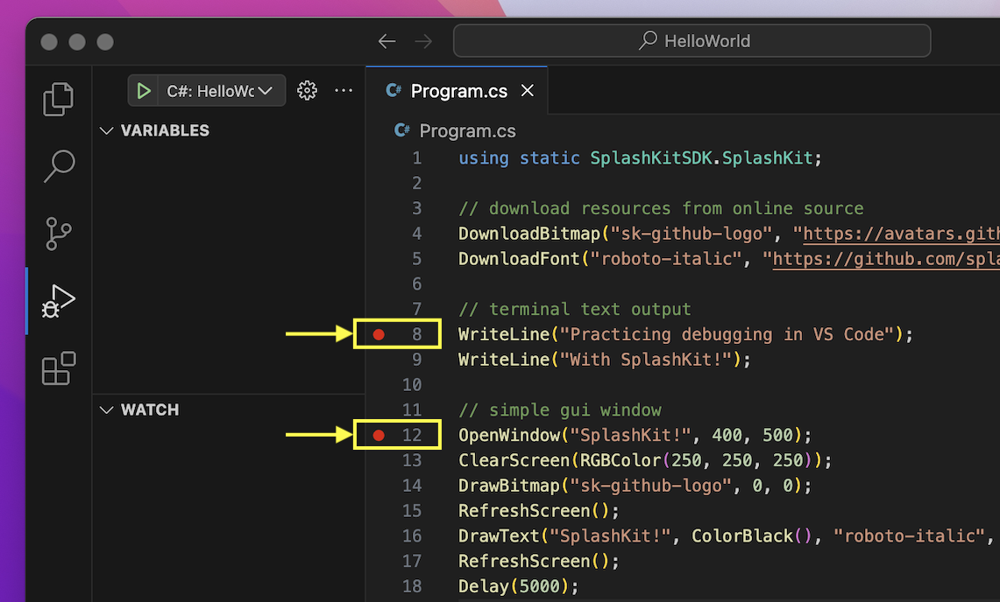
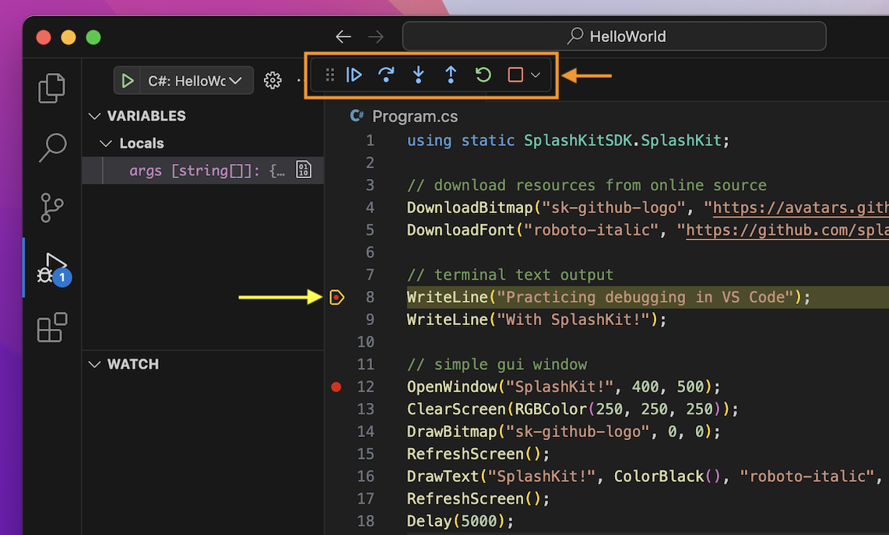
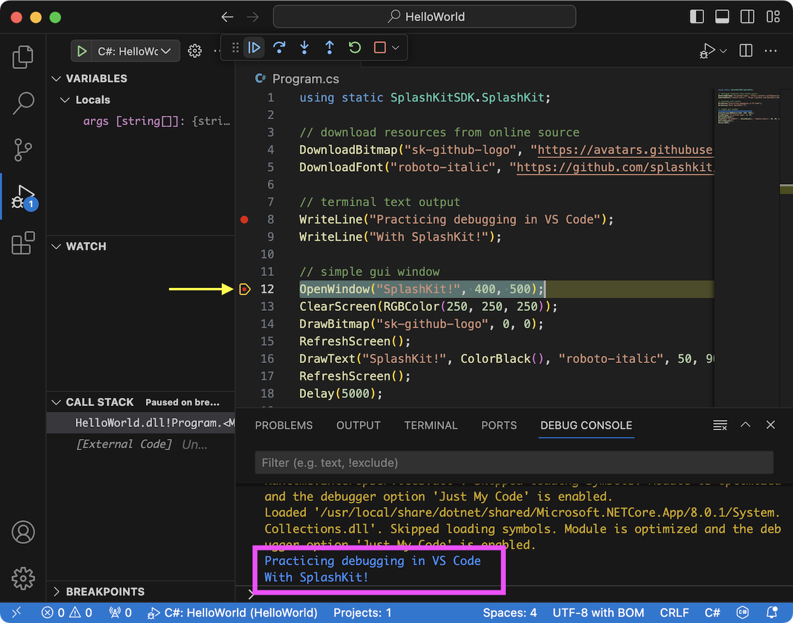
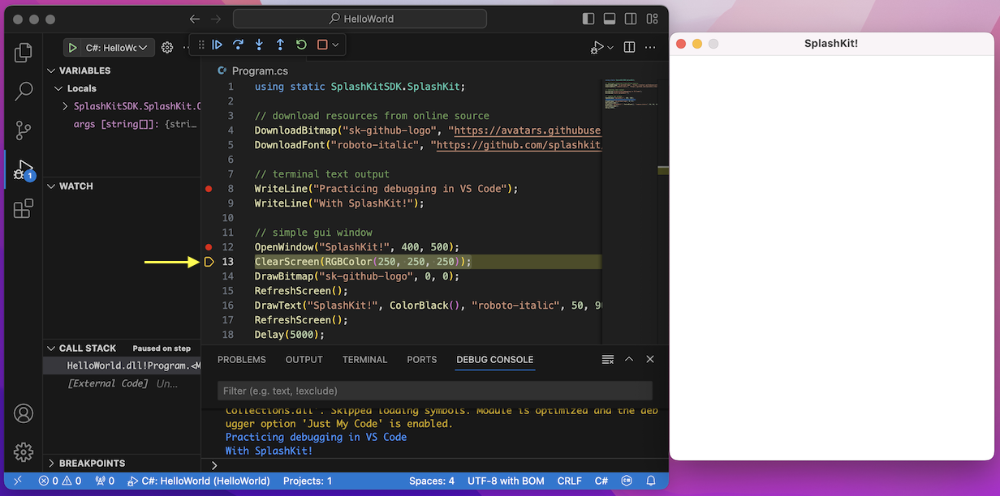

As you continue learning new coding concepts, you will inevitably come across errors (bugs) in your code. Don't be discouraged though! Even the most skilled programmers run into bugs in their programs. You will get better and faster at [Debugging](/book/part-0-getting-started/3-building-programs/2-trailside/04-0-debug) the more you practice.

## Setting up your C# project

In this guide, we will be using the **HelloWorld** project from the [previous page](/book/part-0-getting-started/3-building-programs/1-tour/2-hello-world-gui), but with some simpler code, so that we can focus on the VS Code debugger more easily.

Copy the following example code and paste it into your Program.cs file (replacing existing code) and then run your program using `dotnet run` in your VS Code terminal to test it:

```cs
using static SplashKitSDK.SplashKit;

// download resources from online source
DownloadBitmap("sk-github-logo", "https://avatars.githubusercontent.com/u/16730454?s=400&u=1c5ea7f86f40253bd5883ab2380257f614b44187&v=4", 443);
DownloadFont("roboto-italic", "https://github.com/splashkit/the-programmers-field-guide/raw/main/public/resources/code-examples/part-0/Roboto-Italic.ttf", 443);

// terminal text output
WriteLine("Practicing debugging in VS Code");
WriteLine("With SplashKit!");

// simple gui window
OpenWindow("SplashKit!", 400, 500);
ClearScreen(RGBColor(250, 250, 250));
DrawBitmap("sk-github-logo", 0, 0);
RefreshScreen();
DrawText("SplashKit!", ColorBlack(), "roboto-italic", 50, 90, 410);
RefreshScreen();
Delay(5000);
```

This code will create a window that looks like this:

It will also output the text below, in your terminal:

```text
Practicing debugging in VS Code
With SplashKit!
```

## VS Code Debugger

When you run the VS Code debugger in a C# project for the first time, you will need to set up the 'Run and Debug' configuration. To do this, follow the steps below:

### Set up 'Run and Debug' configuration

To set up the VS Code debugger's *'Run and Debug'* launch configuration for C#, follow the steps below:

Open the debugger and click on the blue **Run and Debug** button (shown in the green box in the image below), then select the **C#** debugger (shown in the orange box):


<div class="caption">Image not subject to The Programmer's Field Guide <a href="https://creativecommons.org/licenses/by-nc-nd/4.0/">CC BY-NC-ND 4.0 License</a></div>

Next, select the **C#: HelloWorld** launch configuration(shown in the yellow box in the image below):


<div class="caption">Image not subject to The Programmer's Field Guide <a href="https://creativecommons.org/licenses/by-nc-nd/4.0/">CC BY-NC-ND 4.0 License</a></div>

This will run the program in mostly the same way as it would by using `dotnet run` in the terminal.

Here is an example of what this would look like:


<div class="caption">Image not subject to The Programmer's Field Guide <a href="https://creativecommons.org/licenses/by-nc-nd/4.0/">CC BY-NC-ND 4.0 License</a></div>

In the image above, you can see:

- The debugging **control panel** (shown in the orange box), which we will use in the next section with breakpoints.
- The **play button** (shown in the pink box) is now visible, and can be used the next time you want to **Debug and Run** your program.
- The **terminal output** (shown in the green box) from lines 8 and 9 of the code, which is now outputted to the *Debug Console* panel rather than the *Terminal* panel.

### Debugging with breakpoints

Let's have a look at how you can utilise **breakpoints** to analyse specific sections of your code:

As shown in the image below, add a breakpoint on line **8** of the code (the first WriteLine) and add another breakpoint on line **12** (OpenWindow line):


<div class="caption">Image not subject to The Programmer's Field Guide <a href="https://creativecommons.org/licenses/by-nc-nd/4.0/">CC BY-NC-ND 4.0 License</a></div>

Run the debugger using the **play button**.

You should now see the yellow marker around the breakpoint on line 8 (yellow arrow pointing to it in the image below), as well as the debugging control panel near the top of the window (shown in the orange box):


<div class="caption">Image not subject to The Programmer's Field Guide <a href="https://creativecommons.org/licenses/by-nc-nd/4.0/">CC BY-NC-ND 4.0 License</a></div>

### Control Panel buttons

Let's test out using the first and second control panel buttons: **continue** and **step-over**.

Click on the first button in the control panel to **continue** to the next breakpoint.


<div class="caption">Image not subject to The Programmer's Field Guide <a href="https://creativecommons.org/licenses/by-nc-nd/4.0/">CC BY-NC-ND 4.0 License</a></div>

You will see that the yellow marker has moved down to the next breakpoint on line 12 (yellow arrow pointing to it in the image above) and the text from lines 8 and 9 has been outputted in the Debug Console (as shown in the pink box).

Now click on the second button in the control panel to **step-over** the current line and move to the next line.

You should see the SplashKit Window pop up, but it might seem like it has disappeared a moment later. It is still there, but you might need to move the window to an area next to your VS Code window like this:


<div class="caption">Image not subject to The Programmer's Field Guide <a href="https://creativecommons.org/licenses/by-nc-nd/4.0/">CC BY-NC-ND 4.0 License</a></div>

As you can see above, the yellow marker will move to show you the current line that will be executed next.

Explore using the step-over button again with the next lines.

:::note

- You might notice some weird things happening with these next lines. Don't worry, it's not a bug! You will learn more about how the SplashKit graphics code works in the [Multimedia Primer](/book/part-1-instructions/1-sequence-and-data/2-trailside/11-2-graphics) page in the next part.
- The **step-into** and **step-out** buttons won't perform properly with this code, so you can ignore these buttons till you get to [Part 2](/book/part-2-organised-code/00-part-2-programs-as-organised-code/).

:::

Developing your debugging skills will be incredibly useful for when you encounter bugs in your own code and need to pinpoint which part is causing the issue.

:::tip[Want to keep practicing?]
You can use the larger Hello World code examples on the previous page to continue testing out the debugger!
:::
