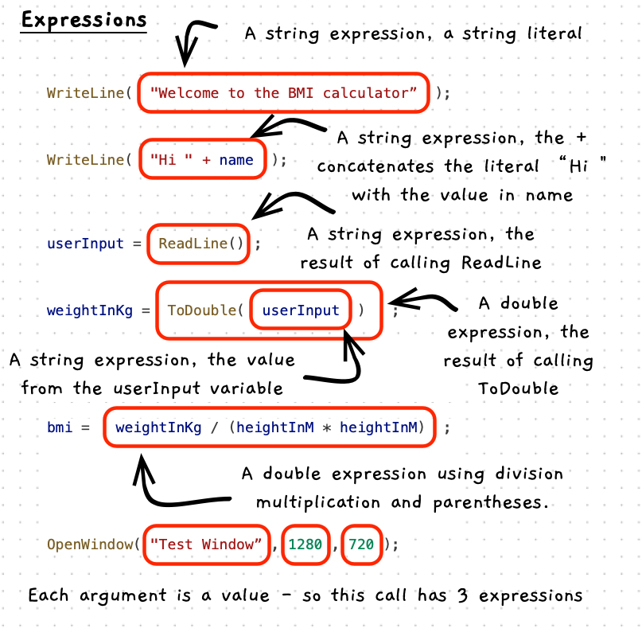

We need values to work within the instructions in our code. In programming terminology the code for a value is known as an **expression**. So far we can have values (expressions) in our method calls and assignment statements. Each assignment statement has an expression that is the value to be assigned to the variable. In each method call, you have expressions for each argument.

Expressions allow you to calculate the value to be used. This can include standard mathematical operator (addition, subtraction, multiplication, and division), and work with values typed into the code (called **literals**), values read from [variables and constants](/book/part-1-instructions/1-sequence-and-data/0-panorama/3-variables), and values returned from [method calls](/book/part-1-instructions/1-sequence-and-data/0-panorama/2-method-call).



:::note[An expression...]

- is a location within your code where a value is required.
- can be calculated using mathematical operators.
- can read values from variables and constants.
- can read the result from a method call.
- is the value to be stored in an assignment statement.
- is the value for each argument in a method call.

:::

:::tip

You use expressions to pass values to methods in method calls, and as the value to be stored in assignment statements. In each case you can calculate the value to be used.

:::

## Example

The expressions are highlighted in the following code that calculates a person's body mass index.

```cs
using static SplashKitSDK.SplashKit;
using static System.Convert;

string name, userInput;
double weightInKg, heightInM;
double bmi;

// The argument is a value (expression) - a string literal
WriteLine("Welcome to the BMI calculator");

// As above - a string expression with the value hard coded
Write("Please enter your name: ");

// The expression's value is the result from the call to ReadLine
name = ReadLine();

// The argument is a string expression - using + to concatenate values
WriteLine("Hi " + name);

// As above - this takes one string value the text to write
Write("Please enter your weight in kilograms: ");
// The value in the assignment is the result of calling ReadLine
userInput = ReadLine();
// There are two expressions here - userInput is used as the value
//  in the call to ToDouble. The result of ToDouble is the 2nd
//  expression as this is the value stored in weightInKg
weightInKg = ToDouble(userInput);

// Same as above - for all three lines
Write("Please enter your height in meters: ");
userInput = ReadLine();
heightInM = ToDouble(userInput);

// There is one expression here - the result stored in bmi
//  it is calculated using division, multiplication etc.
bmi = weightInKg / (heightInM * heightInM);

// You can use string interpolation with $"" this has
//  2 expressions. The value bmi is injected into the string
//  and then the string value is used as the argument in WriteLine
WriteLine($"The BMI of the data entered is: {bmi}");
```

:::note[String interpolation]

C# has the ability to easily inject values within strings using a feature called string interpolation. You can use this by starting the string with a `$` and then inside the string you can place expressions in braces `{...}`. These expressions are calculated, and the values are incorporated in the overall string value.

For example, in C# the string `$"1 + 1 = { 1 + 1 }"` has the value `"1 + 1 = 2"`.

:::

# Activities

What expressions are there in the following lines of code?

1. `age = 21;`
2. `interestPayment = balance * rate;`
3. `WriteLine($"Hello {name}");`
4. `value = ToInt32(line);`
5. `OpenWindow("Hello", 1920, 1080);`

<details>
  <summary role="button">Answers</summary>
  <ul>
    <li><strong>1: </strong>There is one expression - the value 21</li>
    <li><strong>2: </strong>There is one expression - balance * rate</li>
    <li><strong>3: </strong>There are two expressions - name and "Hello {name}"</li>
    <li><strong>4: </strong>There are two expressions - line, and the result of calling ToInt32.</li>
    <li><strong>5: </strong>There are three expressions - "Hello", 1920, and 1080. Each of these is an argument in the OpenWindow method call.</li>
  </ul>
</details>
