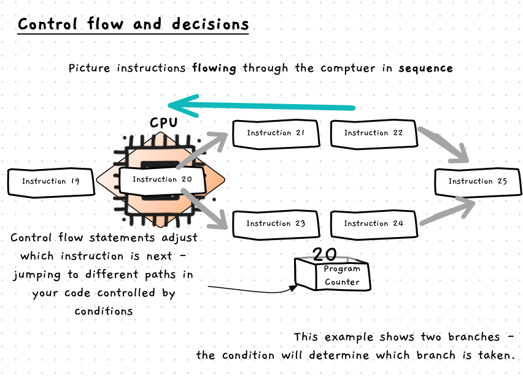

We have been focusing on sequence so far. With sequence, you can picture instructions flowing through the computer as it executes them one at a time.

Control flow is all about controlling that flow of instructions (hence the name - control flow). Each language has several control flow statements that define a certain flow pattern. Each of these patterns is controlled by a condition which evaluates to true of false - which is known as a **boolean** value.



:::note[Control flow...]

- still means that instructions run in [sequence](/book/part-1-instructions/1-sequence-and-data/2-trailside/01-sequence).
- allow you to selective run code - also known as branching.
- allow to to repeat code - also known as looping.
- use conditions to determine which path is taken.
- statements give you the ability to implement algorithms in your code.

:::

:::note[Boolean values...]

- use the `bool` type in C#.
- are used in control flow statements to determine which path to take.
- include only the values `true` and `false`.
- can be created using comparisons:
  - `a == b` is true with `a` equals `b`, otherwise it is false.
  - `a != b` is true with `a` does not equal `b`, otherwise it is false.
  - `a < b` is true with `a` is less than `b`, otherwise it is false.
  - `a <= b` is true with `a` is less or equal to than `b`, otherwise it is false.
  - `a > b` is true with `a` is larger than `b`, otherwise it is false.
  - `a >= b` is true with `a` is larger or equal to than `b`, otherwise it is false.
- can be combined using logical operators:
  - **and**: `a && b` is true when both `a` and `b` *are* true, otherwise it is false.
  - **or**: `a || b` is true when either or both of `a` *or* `b` are true. It is false when both `a` and `b` are false.
- **not** (`!a`) allows you to check if something is false: true is *not* false, and false is *not* true.

:::

:::tip

With control flow you will always be thinking about the condition under which some code should run. Learning to craft these conditions using boolean logic will take practice.

:::

## Example

```cs
using static SplashKitSDK.SplashKit;
using static System.Convert;

// You can create boolean variables to store true/false values.
// There are also keywords for true and false
bool ready = false;

Write("Enter a number: ");
string line = ReadLine();
int value = ToInt32(line);

// You can calculate boolean values using comparisons like this
bool bigValue = value > 100;

Write("Is that a big value for you? [y/n]: ");
string line = ReadLine();

// You can join boolean values using logical operators
// It is big for the user if they entered 'y' or 'Y'
bool bigForUser = (line == 'y') || (line == 'Y');

// You can join any boolean value using the logical operators
bool bigForBoth =  bigForUser && bigValue;
```
