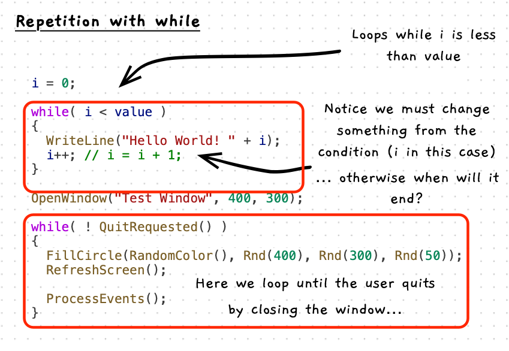

You can repeat code using a while loop. This tests a condition at the start of the instructions. If the condition is true, then the loop is entered and run to their end before returning to the condition to see if the instructions should be run again.



:::note[The while loop...]

- checks its condition and either goes into the loop, or jumps to the next instruction.
- will jump back to the condition when it gets to the end of the loop's instructions.
- runs the body 0 or more times.

:::

:::tip

Remember that the instructions still run in sequence. So the condition is only checked when once at the start of each loop.

:::

## Example

```cs
using static SplashKitSDK.SplashKit;
using static System.Convert;

string line;
int value;
int i;

Write("Enter a number: ");
line = ReadLine();
value = ToInt32(line);

// Use a counter variable (i for historic reasons)
i = 0;

// Loop while i is less than the user's value
while( i < value )
{
  WriteLine("Hello World! " + i);

  // Making sure to change i so that we eventually end!
  i++; // i = i + 1;
}

// For graphical applications
OpenWindow("Test Window", 400, 300);

// You can loop while the user has not asked to quit
while( ! QuitRequested() )
{
  // We can update what the user sees...
  FillCircle(RandomColor(), Rnd(400), Rnd(300), Rnd(50));
  RefreshScreen();

  // Then check if the quit condition has changed
  // Inside ProcessEvents, SplashKit checks if the user has asked to quit
  // So this will ensure that `QuitRequested` will eventually be true.
  ProcessEvents();
}
```
