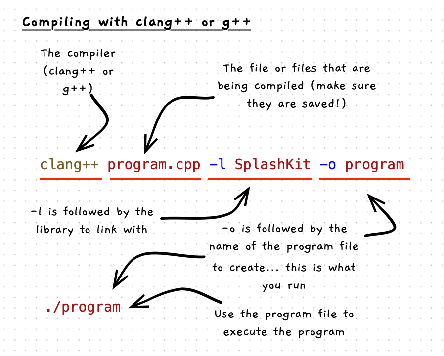

With C#, we used `dotnet run` to compile and execute our programs. With C++, you will have to compile and then run the program as two separate steps.



:::note

- You need to run the compiler to convert your C++ code into machine code you can run.
- Use either the **clang++** or **g++** compiler to do this.
- Pass the compiler the files you want to compile (there is no project file like in C#, so you just need your code in a file).
- You can pass the compiler the libraries you want to link with (use).
- The `-o` option lets you tell the compiler what to call the file it creates.
- You run your program by running the file that the compiler created.

:::

:::tip

Get used to saving, compiling, and then running your code. If you forget to save or compile, then you will be running an earlier version of your program. So if things don't work as expected, make sure the file is saved and that you have compiled it.

:::

## Example

Have a go at the following.

1. Create a new folder for your C++ code.
2. Create a blank "hello.cpp" file for your code.
3. Open the folder in VS Code

    The following shell commands should achieve this, assuming your code is stored in the `~/Documents/Code` path:

    ```zsh
    cd ~/Documents/Code
    mkdir MyCppCode
    cd MyCppCode
    touch hello.cpp
    code .
    ```

4. In VS Code, open the **hello.cpp** file, and enter the following code:

    ```cpp
    #include "splashkit.h"

    int main()
    {
        write_line("Hello World!");
        return 0;
    }
    ```

5. Compile the program using the following shell commands.

   ```zsh
   clang++ hello.cpp -l SplashKit -o hello
   ```

   or...

   ```zsh
   g++ hello.cpp -l SplashKit -o hello
   ```

6. Run the program using:

    ```zsh
    ./hello
    ```

You should see the message "Hello World!" written to the terminal.

## Activities

Do these commands work? How do you run the programs created using the following commands?

1. `clang++ test.cpp -l SplashKit -o test`
2. `g++ program.cpp -o my_program`
3. `clang++ program.cpp -o my_program`
4. `clang++ program.cpp utilities.cpp -o program`

<details>
  <summary role="button">Answers</summary>
  <ul>
    <li><strong>1: </strong>Compiles test.cpp into a program called "test". You run using `./test`.</li>
    <li><strong>2: </strong>This compiles program.cpp into "my_program". This does not link with SplashKit, so this will only work if you do not use any SplashKit code in your project. You run the program using `./my_program`</li>
    <li><strong>3: </strong>This is the same as 2.</li>
    <li><strong>4: </strong>This compiles program.cpp and utilities.cpp into a program called "program". You can run this using `./program`.</li>
  </ul>
</details>
