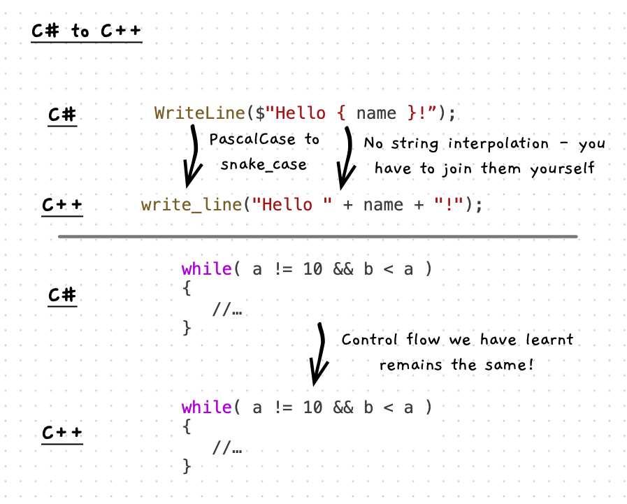

When you switch programming languages, you need to learn how that language works. What we have learnt about C#, converts quite easily to C++. Let's have a quick look at the main differences.



:::note[Different language...]

- have different naming conventions. In C# method names use `PascalCase`, while the equivalent functions/procedures use `snake_case` in C++.
- use different names for their types. C# and C++ include int, double, bool, and string.
- have different control flow statements, though most are similar. The control flow statements we have used in C# are the same in C++.
- support different capabilities when working with strings. In C# we used string interpolation to create strings, while in C++ you have to use concatenate to join together the parts of the strings.
- have different libraries. The C# and C++ languages have different libraries, but the SplashKit library is available across both languages.

:::

:::tip

We are focusing on building your mental model of programming, so the features we have explored so far are common across imperative programming languages.

:::

## Example

The following code is the C++ version of the [menu code](/book/part-1-instructions/3-control-flow/1-tour/2-0-menu) from the control flow chapter.

```cpp
#include "splashkit.h"

int main()
{
  string line;
  int choice;

  do
  {
    write_line("1: Addition");
    write_line("2: Subtraction");
    write_line("3: Multiplication");
    write_line("4: Division");
    write_line("5: Quit");
    write("Enter your choice: ");
    line = read_line();

    while (!is_integer(line))
    {
      write_line("Please enter a whiole number");
      write("Enter your choice: ");
      line = read_line();
    }

    choice = stoi(line);

    switch (choice)
    {
      case 1:
        write_line("Addition");
        break;
      case 2:
        write_line("Subtraction");
        break;
      case 3:
        write_line("Multiplication");
        break;
      case 4:
        write_line("Division");
        break;
      case 5:
        write_line("Quit");
        break;
      default:
        write_line("Invalid choice");
        break;
    }
  } while (choice != 5);
}
```
