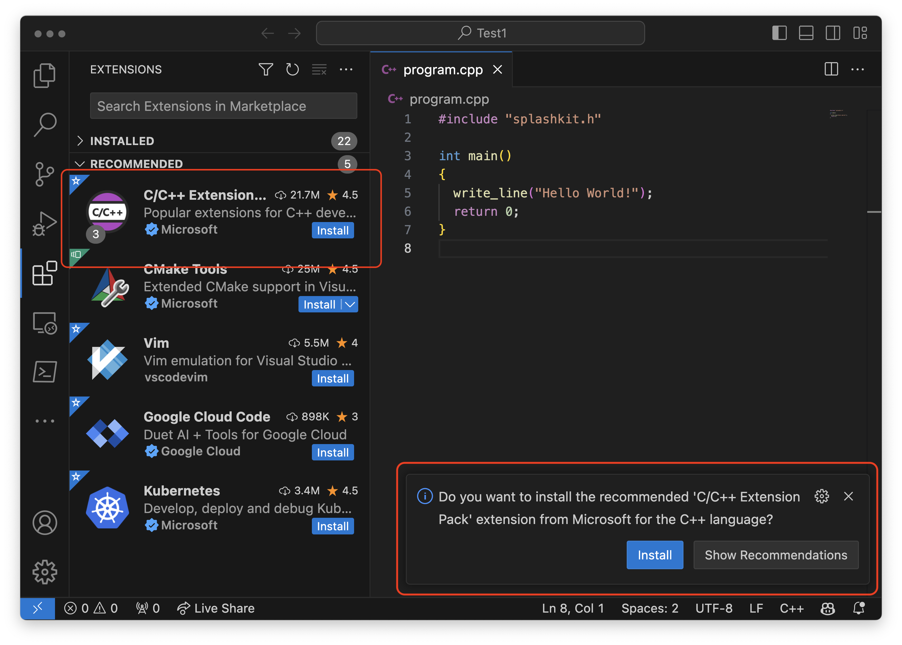
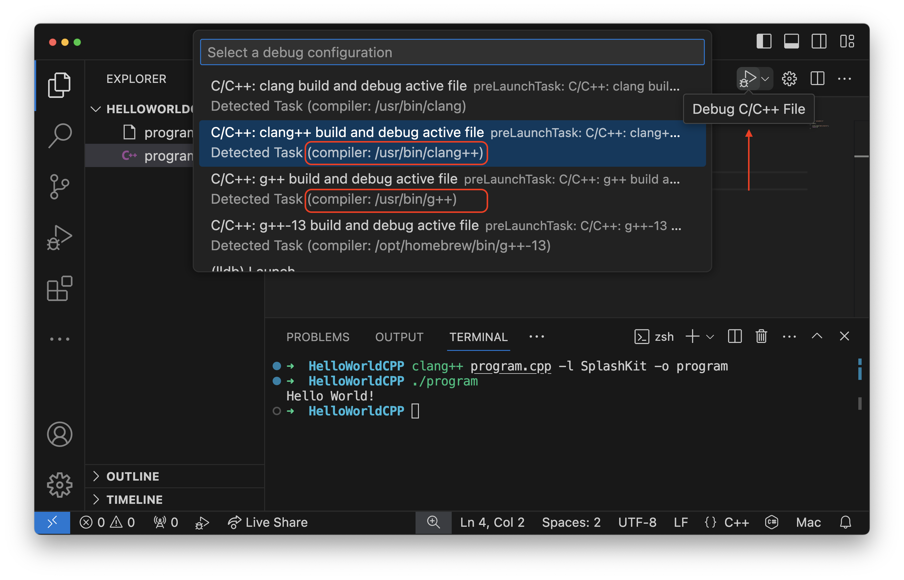

Getting the program compiling and running in the terminal will mean that you now know the steps an editor like Visual Studio Code would need to automate for us.

Visual Studio Code uses [extensions](https://code.visualstudio.com/docs/editor/extension-marketplace) to extend its capabilities to support developers working in a range of languages. To get support with C/C++ we need to install the associated extensions and then configure their settings to get them to link in the required libraries.

The extension you need to install is called the [C/C++ Extension Pack](https://marketplace.visualstudio.com/items?itemName=ms-vscode.cpptools-extension-pack) by Microsoft. Visual Studio Code should automatically show you this in the extensions' pane if you have the program.cpp file open. Click the **install** button to install this extension in your editor.



:::note
Don't panic if it takes a little time for this extension to install and configure itself. It may take a few minutes until the extension is fully activated. The debug button and configuration cog will appear once the extension is fully activated.
:::

With the extension installed, you now need to add some files to configure this to work with your code. The extension will have added a quick configure button that will help get you started. With your **program.cpp** file selected, click the **debug/play** icon near the top right of the window as highlighted in the following image. This button can be used to compile and run your program.

When you click the *debug/play* icon, it will open a prompt where you can select the compiler you want to use. You can choose either the **g++** or the **clang++** compiler. While the clang compiler is our preferred compiler, it is newer and isn't yet fully integrated into VS Code across all platforms. As a result, you will need to use g++ and its debugger (**gdb**) on Linux and Windows. On macOS, you should use clang++ and its debugger (**lldb**).

The image below shows the options on macOS. This lists both the clang++ and g++ compiler options. Select the appropriate option based on the operating system you are using.



This will create a **tasks.json** files in a hidden **.vscode** folder, and will then attempt to build your program. At the moment, this will fail as we need to tell the compiler to link in the SplashKit library. Let's have a look at how to do that next.

:::tip[Hidden Folders]
Remember that folders that start with a `.` are hidden in unix. They do not appear in `ls` commands unless you add the `-a` option.
:::

### Configuring the Build Task

The **tasks.json** file contains various settings related to compiling the program, as shown below. We need to provide this with the additional options we provided to the compiler when we compiled our program through the terminal. The **args** setting is a list of the values to pass as arguments to the compiler. You need to extend this with extra options to link the SplashKit library as shown below.

```json
{
  "tasks": [
    {
      "type": "cppbuild",
      "label": "C/C++: g++ build active file",
      "command": "/usr/bin/g++", // It will be clang++ here on macOS
      "args": [
        "-fdiagnostics-color=always",
        "-g",
        "${file}",
        "-l",
        "SplashKit"
        "-o",
        "${fileDirname}/${fileBasenameNoExtension}"
      ],
      "options": {
        "cwd": "${fileDirname}"
      },
      "problemMatcher": [
        "$gcc"
      ],
      "group": {
        "kind": "build",
        "isDefault": true
      },
      "detail": "Task generated by Debugger."
    }
  ],
  "version": "2.0.0"
}
```

Each argument is added as a separate string within quotes, separated by commas.
So, we added the following lines to our **tasks.json**:

```json
        "-l",
        "SplashKit"
```

:::note[MSys?]
For MSys, you will need to change the command to be the path to the g++.exe in your msys64, mingw64 folder as shown below:

```json
{
  "tasks": [
    {
      // as before
      "command": "C:\\msys64\\mingw64\\bin\\g++.exe",
      // as before
    }
  ],
  "version": "2.0.0"
}
```

:::

These settings tell VS Code how to build a selected C++ file that uses the SplashKit library. With your *program.cpp* file selected, you can build the program using **ctrl-shift-b** (**cmd-shift-b** on macOS) or selecting **Tasks: Run Build Task** from the [command palette](https://code.visualstudio.com/docs/getstarted/userinterface#_command-palette).

In the terminal window in VS Code you should see the output from this, as shown below. Make sure that you can see that this ran successfully.

```zsh
 *  Executing task: C/C++: clang++ build active file 

Starting build...
/usr/bin/clang++ -std=gnu++14 -fcolor-diagnostics -fansi-escape-codes -g /Users/acain/Documents/Code/Test2/main.cpp -o /Users/acain/Documents/Code/Test2/main -l SplashKit

Build finished successfully.
 *  Terminal will be reused by tasks, press any key to close it. 
```

At this point, you have Visual Studio Code set up to build the currently selected file into a program.

Going forward, you can edit the tasks.json to compile multiple files. To do this you need to change the argument that passes in what to compile, and the output option in the following ways:

- Change **"${file}"** to **"*.cpp"**. This will then compile all cpp files.
- The **"-o"** argument is followed by the name of the program to create. This is **"${fileDirname}/${fileBasenameNoExtension}"** which names the program after the selected file. When building multiple files you can provide a fixed value here like **"program"**. This will then always build the same output regardless of which source file is selected.

### Configuring Launch

If you have your computer setup correctly, you should be able to 

Configuring VS Code to run your C/C++ program is much simpler than configuring the settings needed for compiling. The defaults in **launch.json** do not need changing if you have not changed the "-o" option in the tasks.json file. They should appear as shown below.

```json
{
    "configurations": [
        {
            "name": "C/C++: clang++ build and debug active file",
            "type": "cppdbg",
            "request": "launch",
            "program": "${fileDirname}/${fileBasenameNoExtension}",
            "args": [],
            "stopAtEntry": false,
            "cwd": "${fileDirname}",
            "environment": [],
            "externalConsole": false,
            "MIMode": "lldb",
            "preLaunchTask": "C/C++: clang++ build active file"
        }
    ],
    "version": "2.0.0"
}
```

:::note[MSys changes]
With MSys2, you need to adjust the program path, but also the MIMode and provide some additional instructions to configure gdb to work with VS Code. The following setting should work.

```json
{
  "configurations": [
    {
      "name": "C/C++: clang++ build and debug active file",
      "type": "cppdbg",
      "request": "launch",
      "program": "${fileDirname}\\${fileBasenameNoExtension}.exe",
      "args": [],
      "stopAtEntry": false,
      "cwd": "${fileDirname}",
      "environment": [],
      "externalConsole": false,
      "MIMode": "gdb",
      "miDebuggerPath": "C:\\msys64\\mingw64\\bin\\gdb.exe",
      "setupCommands": [
        {
          "description": "Enable pretty-printing for gdb",
          "text": "-enable-pretty-printing",
          "ignoreFailures": true
        },
        {
          "description": "Set Disassembly Flavor to Intel",
          "text": "-gdb-set disassembly-flavor intel",
          "ignoreFailures": true
        }
      ],
      "preLaunchTask": "C/C++: clang++ build active file"
    }
  ],
  "version": "2.0.0"
}
```

:::

To run your code in the debugger, use the "run and debug" icon in the debugger pane as you did with C#. You should be able to add breakpoints and step through the code as before.

Notice that unlike with C#, the output does not go into the terminal window. To include terminal input and output, you need to change the "externalConsole" setting to `false`. When you run the debugger now, it will open the default terminal program and allow you to use it for input and output.

If you change the "-o" setting in tasks.json, you will also need to change it in **launch.json**. In this case the **"program"** value indicates the name of the program to run. The default **"${fileDirname}/${fileBasenameNoExtension}"** can be changed to something like **"program"** if you update this in the tasks file.
