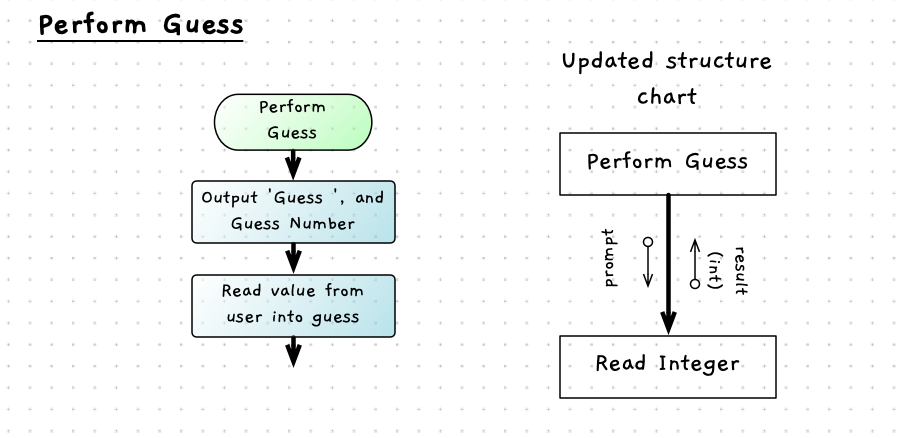
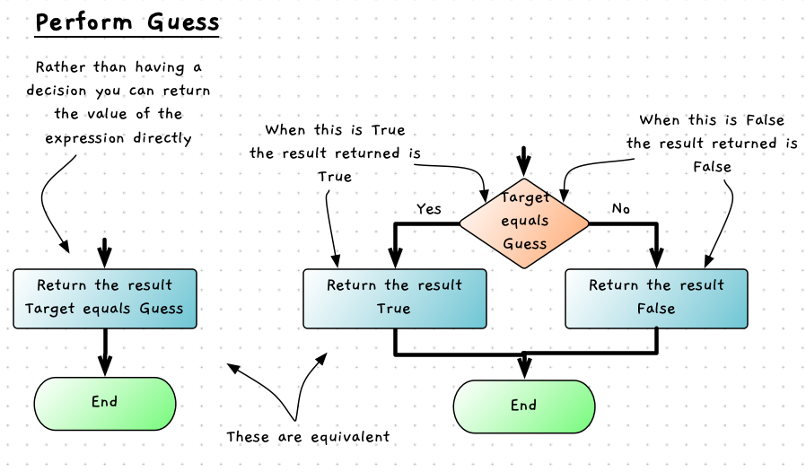

Now that we have the different functions and procedure, we can now start to design the control flow for the Guess that Number program. For the Guess that Number program we can start by designing the control flow within the `Perform Guess` function. The specification of this is shown the table below. Think about the steps that need to be performed to achieve this. If you had been asked to do this what would you need to do?

<br/>
<a id="TablePerformGuessSpecs"></a>

|   |   |
|---|---|
| **Function** | `Perform Guess` |
| **Description** |  `Perform Guess` is responsible for coordinating the actions needed to perform a single guess within a game of *Guess that Number*. The user's `guess` is read, and the value checked against the `target` value. A message is then output telling the user if the target value is less than, larger than, or equal to their guess. This function returns true when the user’s guess is equal to the target, otherwise it returns false.|
| **Returns** | `Boolean`: True when the user has guessed the number, false otherwise. |
| **Parameters** | `Guess Number`: The number of the current guess (from 1st to 7th guess), used in the prompt asking for the user to enter their guess. |
|| `Target`: The number the user is aiming to guess. |

<div class="caption">Specification for the <code>Perform Guess</code> function</div><br/>

## Read the Guess

The first task the function needs to perform is to get the guess from the user. This can be performed in a **sequence**: display a prompt, read the value from the user.



<div class="caption">Initial sequence for the Perform Guess function</div><br/>

This sequence sounds familiar, and is likely to be something we may want to use elsewhere. So, let's create a `read_integer` function and update the structure chart. To make this useful in many places, we can have a `prompt` parameter that is passed the message to show the user.

We have an overall plan, so we can start to code this up as we go. It is good to get this going to see how it is realised in code as we progress. The initial code for this is shown below, with the read integer logic coming from the code we used in the change calculator previously. This can now be put into a function.

```cpp
#include "splashkit.h"

/**
 * Read an integer from the user
 *
 * @param prompt the message to show the user
 * @returns the integer entered
 */
int read_integer(string prompt)
{
  write(prompt);
  string line = read_line();
  while (!is_integer(line))
  {
    write_line("Please enter a whole number.");
    write(prompt);
    line = read_line();
  }
  return stoi(line);
}

/**
 * Perform the steps for the guess. Reads the value entered by the user,
 * outputs a message, and then returns true if the got it otherwise it returns
 * false.
 *
 * @param guess_number the sequence number of the guess, this should start at 1
 * @param target the number the user is aiming to guess
 *
 * @return true if the user guesses the number, otherwise false.
 */
bool perform_guess(int guess_number, int target)
{
  int guess;

  guess = read_integer("Guess " + to_string(guess_number) + ": ");

  return false;
}

int main()
{
  perform_guess(1, 37);
  return 0;
}
```

## Give Feedback

The next step in this sequence is to give the user feedback based upon their guess and the target number. This code requires the ability to *select* a given branch. The computer needs to output different messages
based upon the user's guess.

This can be achieved with a **selection** block. To achieve this we will need to group together a few if-else statements. The first `if-else` block can check if the `target` is greater than the user's `guess`. If this is true then the computer can take the first branch and output the message 'The number is larger than ' and the value from the user's guess. The flow chart for this part is shown in [Figure x.y](#FigurePerformGuessFirstBranch).

import performGuessFirstBranch from './images/guess-that-number-perform-guess-first-branch.png';

<a id="FigurePerformGuessFirstBranch"></a>

<div class="caption">First branch in Perform Guess</div><br/>

:::note

- The conditions within the if statement are Boolean expressions
- This condition is checking if target > guess
- There are now two paths through this code: one when target is > guess, and another when it is not

:::

Following the false path from the first decision, and we have a new location into which to insert a block. At this point we know the target is *not* larger than the user's guess, so we can include another `if-else` block to check if the target is **less than** the user's guess. This is shown in [Figure x.y](#FigurePerformGuessSecondBranch)

import performGuessSecondBranch from './images/guess-that-number-perform-guess-second-branch.png';

<a id="FigurePerformGuessSecondBranch"></a>

<div class="caption">Second branch tests if the Target is less than the guess</div><br/>

:::note

- The newly added block is another if statement
- This is nested within the `else` branch of the first if statement
- This code checks *if* `target` < `guess`
- There are now three paths through this code

:::

Taking the false path again, and now we have a location at which the target value *must be* equal to the user's guess. The first condition checked if the `target` was larger than the `guess`, which it was not. The second condition checked if the `target` was less than the `guess`, which it was not. So the only way it can get here is when the `target` and the `guess` are equal. This path can then be used to output the 'Well done...' message. This is shown in [Figure x.y](#FigurePerformGuessThirdPath)

import performGuessThirdPath from './images/guess-that-number-perform-guess-third-path.png';

<a id="FigurePerformGuessThirdPath"></a>

<div class="caption">The 'Well done...' message can be output on the third path</div><br/>

:::note

- The newly added block is a sequence, outputting the 'Well done...' message
- On this third path the `target` and `guess` must be equal
- Notice the single exit out of the second branch, which then flows to the single exit out of the first branch.

:::

## Returning

The last action in the code is to return a Boolean result indicating if the user's guess is equal to the target number.

<a id="FigurePerformGuessBooleanReturnValue"></a>


<div class="caption">A Boolean result is returned from the function</div><br/>

:::note

- The newly added block is a single action, defining the result to be returned
- This action returns the result `true` when the `target` and the `guess` are the same

:::

[Figure x.y](#FigurePerformGuessResultCalc) shows the *trick* that is being performed at the end of `Perform Guess`'s code. `Perform Guess` needs to return a result indicating if the user has guessed the number of not.
This will be a Boolean value, with true indicating they guessed the number. Initially it may seem that you need a **selection** block to enable this, as shown on the right of [Figure x.y](#FigurePerformGuessResultCalc). However, you do not need this branch. Instead, you can just directly return the expression that would have been used in the if statement's condition.

<br/>
<a id="FigurePerformGuessResultCalc"></a>


<div class="caption">Calculating Perform Guess's result</div><br/>

:::note

- In *most* cases it is better to have less code if possible, as long as this does not obscure the purpose of the code
- This is an example of replacing *actions* with *data*. The more *intelligence* you can build into the data in your programs, the more flexible they will be

:::

## Structured Programming Blocks

[Figure x.y](#FigurePerformGuessBlocks) shows a flowchart with annotations highlighting the different blocks within the code. The function starts off with a **sequence** that contains all the code in the function. Within this there is the **selection**, that internally contains another **selection**.

<br/>
<a id="FigurePerformGuessBlocks"></a>


<div class="caption">Blocks in the Perform Guess code</div><br/>

:::note

- Notice that each block has a single path going into it, and a single path coming out

:::

## The Pseudocode for Perform Guess

[Listing x.y](#ListingPerformGuessPseudoCode) contains the pseudocode for the `Perform Guess` logic from the flowchart in [Figure x.y](#FigurePerformGuessBooleanReturnValue). Notice how the indentation mirrors the block structures in the flowchart. It is good practice to indent your code in this way as it helps you, and any person who reads your code, to see the structure of the logic. You will be able to avoid many errors by making sure that you always indent your code so that it highlights the code's structure.

<br/>
<a id="ListingPerformGuessPseudoCode"></a>

```
Function: Perform Guess
--------------------------------
Parameters:
    Num Guess (Integer): The number of the guess (1..7)
    Target (Integer): The target the user is aiming for
Returns: Boolean - True if the user has guessed the Target
Steps:
    Ouput 'Guess ', num_guess, and ': '
    Read input into guess

    if target is less than guess then
       Output 'The number is less than ', guess
    else
       if target is larger than guess then
           Output 'The number is larger than ', guess
       else
           Output 'Well don... the number was ', guess
    
    Return target == guess 
```
<div class="caption">Pseudocode for <code>Perform Guess</code></div><br/>

:::note

- Code indentation makes it easier to read, and helps locate many common issues.
- Tab your code in with a **structured statement**
  - Indent the code in the branches of an If Statement and Case Statement
  - Indent the code within the body of the **While Loop** and the **Do While** or **Repeat Until** loops
- Make this a habit. When you code a **Branching** or **Looping** statement, automatically indent the next line of code
- Always keep your code neat, make it look good
- Remember to watch out in the comparison use `==` not `=` in your C/C++ code
:::
