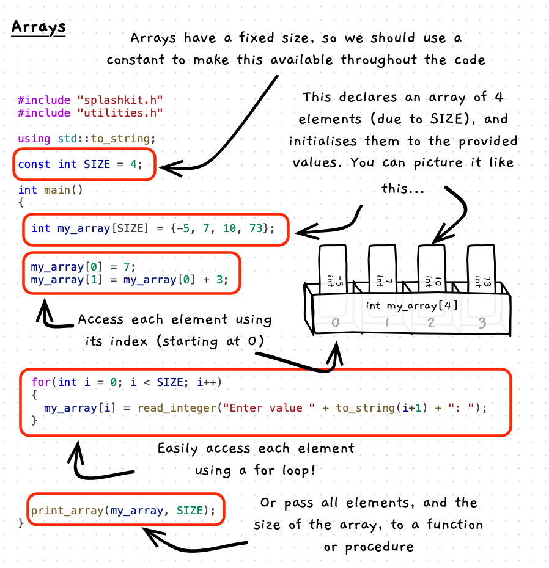

An array is a variable that contains multiple values, each accessible via an index. In C/C++, an array does not remember its size, so this is something we need to remember and keep track of throughout the program.

You declare an array using square brackets (`[]`), inside which you specify the size of the array. This will give you elements that can be accessed via an index, starting at index 0. As a result, when you declare an array with 4 elements, it will use indexes 0 to 3.

Working with an array usually involves using for loops to iterate over each element of the array, with the for loop's control variable tracking the valid indexes. You can also access individual array elements directly, and pass the whole array to a parameter. When passing an array to a function or procedure, you will also need to pass on the size of the array so that the procedure knows which indexes it can access.

Here is an illustration showing the declaration and use of an array.



:::note[An array...]

- is a kind of **variable**.
- has a set size - indicated in the `[]` when it is declared - e.g. `int my_array[4];`
- stores multiple values, with each element accessed via an index.
- elements are accessed by placing an index within `[]` after the variable name - e.g. `my_array[2]`.
- works well with a [for loop](/book/part-1-instructions/3-control-flow/1-concepts/04-3-for-loop.mdx), as the for loop can iterate over the valid indexes allowing you to process each element of the array.

:::

## Example

```cpp
#include "splashkit.h"
#include "utilities.h"

const int SIZE = 10;

void print_array(int arr[], int size)
{
  for(int i = 0; i < size; i++)
  {
    int value = arr[i];
    write_line("Value " + to_string(i + 1) + " is " + to_string(value));
  }
}

int main()
{
  int my_array[SIZE];
  int other[3] = {-5, 7, 10};

  my_array[0] = 7;
  my_array[1] = 10;

  for(int i = 0; i < SIZE; i++)
  {
    my_array[i] = read_integer("Enter value " + to_string(i+1) + ": ");
  }

  for(int i = 0; i < SIZE; i++)
  {
    int value = my_array[i];
    write_line("The value of my_array[" + to_string(i) + "] = " + to_string(value));
  }

  print_array(my_array, SIZE);
}

```
