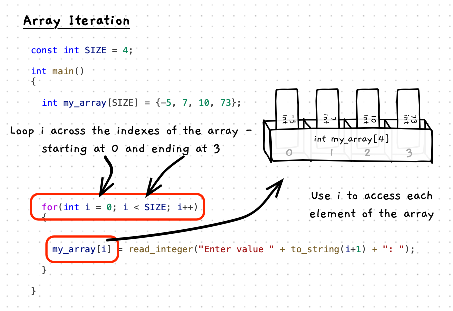

For loops work nicely with arrays, allowing you to easily craft a loop that iterates through valid indexes. The simplest version loops from 0, while the index variable is less than the size of the array.

The following image illustrates how the for loop allows you to iterate across the indexes of the array.



:::note

- The for loop works nicely with the array.
- Basic iteration involves looping from 0, while the control variable is less than the size of the array.
- You can also loop over parts of the array using the same pattern.

:::

## Example

```cpp
#include "splashkit.h"
#include "utilities.h"

const int SIZE = 10;

void print_array(int arr[], int size)
{
  for(int i = 0; i < size; i++)
  {
    int value = arr[i];
    write_line("Value " + to_string(i + 1) + " is " + to_string(value));
  }
}

int main()
{
  int my_array[SIZE];
  int other[3] = {-5, 7, 10};

  my_array[0] = 7;
  my_array[1] = 10;

  for(int i = 0; i < SIZE; i++)
  {
    my_array[i] = read_integer("Enter value " + to_string(i+1) + ": ");
  }

  for(int i = 0; i < SIZE; i++)
  {
    int value = my_array[i];
    write_line("The value of my_array[" + to_string(i) + "] = " + to_string(value));
  }

  print_array(my_array, SIZE);
}

```
